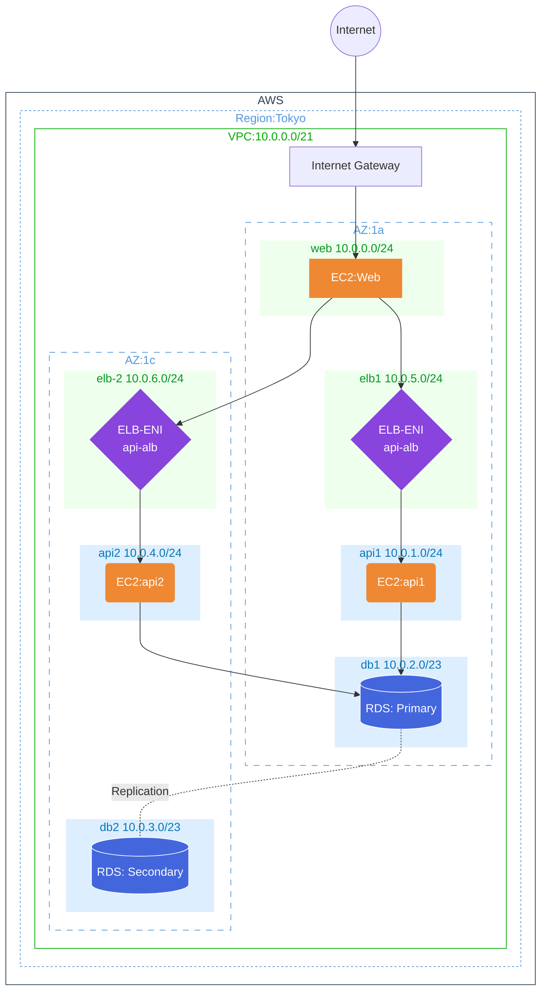

# ct_sprints_iimura

## Sprints

- [x] Sprint1: Network and Servers
- [x] Sprint2: RDS and Authentication
- [x] Sprint3: Redundancy (ALB/Auto Scaling)
- [ ] Sprint4: Contents Delivery
      (Cloudfront/Route53/CertificateManager/s3-Webfront)
- [ ] Sprint5: Container (ECR/ECS/Fargate/NAT)
- [ ] Sprint6: DevOps (CodePipeline/CodeBuild/CodeDeploy)

## Network

- VPC (10.0.0.0/21)
- InternetGateway (sprints_reservation_ig)
- NAT Gateway

- Public Subnets

  - web-subnet-01 (10.0.0.0/24, Public, web-routetable)
  - alb-subnet-01,02 (10.0.5.0/24, 10.0.6.0/24, Public)

- Private Subnets

  - api-subnet-01/02 (10.0.1.0/24, 10.0.4.0/24 Private, api-routetable)
  - db-subnet-01/02 (10.0.2.0/23, Private, db-routetable, db-subnet-group)

- WEB 各サーバには個別の EIP を割り当て、ブラウザから直接アクセス

## Compute

- WEB サーバ
  - web-server-01
  - AmazonLinux
  - EIP
  - Nginx
- API サーバ
  - api-server-01
  - AmazonLinux
  - Nginx/Go/mysql
- RDS サーバ(Multi AZ)
  - Aurora MySQL
  - db.t3.small
  - mysql8.0

## Todo

### Sprint3 Completed

- 課題解決

  - 起動順(DB>API>ALB>WEB)
    それぞれの依存関係およびヘルスチェックのエラー回避
  - aws_instance と aws_launch_template の ebs 設定の違い
  - alb の health_check をクリアするためのスクリプト改善
    - api-base-ami 作成し pkg インストールし依存関係のない設置値も事前に入れておく
    - launch_template からは最低限のセッティングだけを apib_user_data.sh.tmpl に入れる

- Tasks
  - [x] api-subnet-02 作成
  - [x] api-subnet-01 Private 設定(routetable 変更)
  - [x] api-server-02 作成
  - [x] alb-subnet 作成
  - [x] ALB 作成(TargetGroup/Listner)
  - [x] web-server 設定変更(config.js)
  - [x] auto-scaling 設定
  - [x] 起動確認・動作確認

### Sprint2 Completed

- サーバ作成順（depends_on）
- 変数利用（variables.tf,terraform.tfvars）
- user_data.sh の失敗で停止(set -euo pipefail)
- user_data.sh のパッケージインストール失敗を保険(for,if,etc)
- user_data.sh で DB 接続を確認して後続処理を走らせる(until)
- user_data.sh で特定 PID を変数にして kill する処理
- user_data.sh の処理待ちの確認(EC2: Actions-"Monitor and troubleshoot"-"Get system log")

### Sprint1 Completed

- 要件: Web アプリケーション起動および"API Test"の正常動作
- 結果:
  - Terraform で構成作成
  - user_data.sh.tmpl を使って自動化
    - スクリプト作成
    - 値の渡し方(templatefile,ヒアドキュメント)
