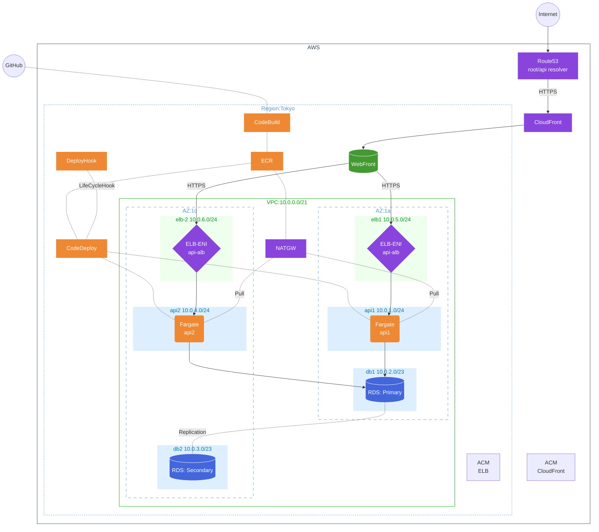

# ct_sprints_iimura

## Sprints

- [x] Sprint1: Network and Servers
- [x] Sprint2: RDS and Authentication
- [x] Sprint3: Redundancy (ALB/Auto Scaling)
- [x] Sprint4: Contents Delivery
      (Cloudfront/Route53/CertificateManager/s3-Webfront)
- [x] Sprint5: Container (ECR/ECS/Fargate/NAT)
- [x] Sprint6: DevOps (CodePipeline/CodeBuild/CodeDeploy)
  - [x] Rolling Deployment
  - [x] Blue/Green Deployment
  - [x] Lambda 検知

## Network

## Compute

- WEB フロント(s3)
- API サーバ (ECS:Fargate)
  - api-server-01
  - AmazonLinux
  - Nginx/Go/mysql
- RDS サーバ(MySQL MultiAZ)
  - Aurora MySQL
  - db.t3.small
  - mysql8.0

## Sprint6 Tasks

- [x] アプリケーションリポジトリの分離 (`cloudtech-reservation-api`)
- [x] CodeBuild 設定 (`buildspec.yml`)
- [x] CI/CD パイプライン構築 (`cicd.tf`)
  - CodeStar Connection (GitHub 連携)
  - CodeBuild (Docker ビルド & ECR Push)
  - CodePipeline (Source -> Build -> ECS Deploy)
- [x] Rolling Deployment
- [x] Blue/Green Deployment
- [x] 動作確認 (GitHub Push -> 自動デプロイ)

### Sprint6 Points

- **リポジトリの責務分離**
  インフラ (`terraform/`) とアプリ (`cloudtech-reservation-api/`) のリポジトリを分けることで、アプリ開発者がインフラを意識せずにデプロイできる構成に。
  Terraform 側では `.gitignore` でアプリディレクトリを除外していますが、CodePipeline は GitHub 上のアプリリポジトリを直接参照するため問題なく動作します。

- **環境変数の注入**
  ECR のリポジトリ URL など、Terraform で作成される動的な値を `aws_codebuild_project` の `environment_variable` を通じて `buildspec.yml` に渡しています。これにより、ビルドスクリプト内にハードコードを避けています。

- **ECS Standard Deployment**
  今回は Blue/Green デプロイ（CodeDeploy）ではなく、ECS 標準のローリングアップデートを採用しました。
  `imagedefinitions.json` をアーティファクトとして渡すことで、CodePipeline が自動的にタスク定義のイメージ URI を書き換えてデプロイします。

- **Blue/Green Deployment**
  - Blue/Green デプロイメントの実装・テスト実施。
  - Terraform で Blue/Green を実装する場合、コンソール設定と同じく buildspec.yml の生成だけですすめれれるが、進行上は appspec.yml や taskdef.json の生成も必要。
  - DockerHub からの Ratelimit 対策として、ECR への Push は GitHub Actions で行い、CodeBuild では Pull のみ行うように設定。

### Sprint5 Completed: Problem/Resolution

- ECS サービス作成エラー (InvalidParameterException)
  ALB と ECS サービスの間に循環依存 (`depends_on`) が発生し、ターゲットグループが ALB に紐付く前に ECS サービスが作成されようとしたためエラー。`alb.tf` の `depends_on` を削除し、逆に `compute.tf` の ECS サービス側で `depends_on = [aws_lb_listener...]` を設定して解決
- CORS エラー (No 'Access-Control-Allow-Origin')
  パブリックイメージ (`public.ecr.aws`) には CORS 対応が含まれていなかったため発生。ローカルの Go コード（CORS 対応済み）をビルドし、自身の ECR リポジトリ (`sprints-api`) に Push して解決
- ポート不整合
  環境変数 `API_PORT=80` に対し、タスク定義や ALB が `8080` を向いていたため通信不可。全て `80` に統一して解決
- タスク定義が更新されない (非アクティブのまま)
  `lifecycle { ignore_changes = [task_definition] }` が設定されていたため、新しいイメージを指定しても ECS サービスが古いタスク定義を使い続けていた。設定を削除して解決
- DB 初期化
  Fargate 化に伴い `user_data` が実行されなくなるため、DB 初期化（テーブル作成）が行われない問題が発生。
  **解決策:** Go アプリケーション (`main.go`) に起動時に DB とテーブルを自動作成する処理 (`initDB`) を追加し、インフラに依存せずアプリ側で完結するように修正。
- ヘルスチェック失敗 (Unhealthy)
  アプリは起動しているが ALB からのヘルスチェックがタイムアウトする現象が発生。
  一時的に VPC 全開放 (`0.0.0.0/0`) や VPC 内限定 (`cidr_blocks`) で切り分けを行ったが、最終的にはセキュリティ要件を満たすため **ALB のセキュリティグループ参照 (`source_security_group_id`)** に戻して動作確認はしていない。
- 不要なポート開放の削除
  Fargate 化に伴い SSH 接続（ポート 22）は不要となるため、セキュリティグループのインバウンドルールから削除。

### Sprint4 Completed: Problem/Resolution

- 追加レコードの検証が完了しない
  ホストゾーンとレジストラの NS レコード設定が必要（ホストゾーンの作成とレコード追加・検証の同時作業は不可）
- CloudFront CNAME エラー (InvalidViewerCertificate)
  ACM 証明書が Apex ドメインのみで `www` を含んでいなかったため、CloudFront の Aliases から `www` を除外して対応
- Route53 Alias エラー (InvalidChangeBatch)
  ALB への Alias レコード作成時、`zone_id` に Route53 のゾーン ID ではなく、ALB のゾーン ID (`aws_lb.api_alb.zone_id`) を指定する必要があった
- CORS エラー (No 'Access-Control-Allow-Origin')
  API サーバー(Nginx)が CORS ヘッダーを返していなかったため、`user_data` で Nginx 設定を追加し、`Access-Control-Allow-Origin` を付与
- 設定変更が反映されない (Timeout)
  `user_data` で Nginx 設定ファイルを書き換えた後、`start` ではなく `restart` を実行しないと新設定が読み込まれない問題を修正

### Sprint3 Completed: Problem/Resolution

- 課題解決

  - 起動順(DB>API>ALB>WEB)
    それぞれの依存関係およびヘルスチェックのエラー回避
  - aws_instance と aws_launch_template の ebs 設定の違い
  - alb の health_check をクリアするためのスクリプト改善
    - api-base-ami 作成し pkg インストールし依存関係のない設置値も事前に入れておく
    - launch_template からは最低限のセッティングだけを apib_user_data.sh.tmpl に入れる

- Tasks
  - [x] api-subnet-02 作成
  - [x] api-subnet-01 Private 設定(routetable 変更)
  - [x] api-server-02 作成
  - [x] alb-subnet 作成
  - [x] ALB 作成(TargetGroup/Listner)
  - [x] web-server 設定変更(config.js)
  - [x] auto-scaling 設定
  - [x] 起動確認・動作確認

### Sprint2 Completed: Problem/Resolution

- サーバ作成順（depends_on）
- 変数利用（variables.tf,terraform.tfvars）
- user_data.sh の失敗で停止(set -euo pipefail)
- user_data.sh のパッケージインストール失敗を保険(for,if,etc)
- user_data.sh で DB 接続を確認して後続処理を走らせる(until)
- user_data.sh で特定 PID を変数にして kill する処理
- user_data.sh の処理待ちの確認(EC2: Actions-"Monitor and troubleshoot"-"Get system log")

### Sprint1 Completed: Problem/Resolution

- 要件: Web アプリケーション起動および"API Test"の正常動作
- 結果:
  - Terraform で構成作成
  - user_data.sh.tmpl を使って自動化
    - スクリプト作成
    - 値の渡し方(templatefile,ヒアドキュメント)
