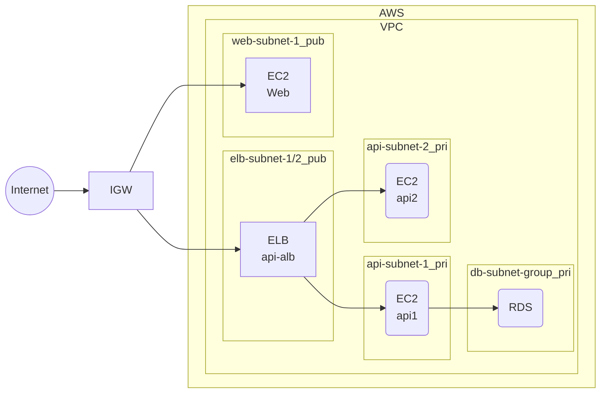

# ct_sprints_iimura

## Sprints

- [x] Sprint1: Network and Servers
- [x] Sprint2: RDS and Authentication
- [ ] Sprint3: Redundancy (ALB/Auto Scaling)
- [ ] Sprint4: Contents Delivery
      (Cloudfront/Route53/CertificateManager/s3-Webfront)
- [ ] Sprint5: Container (ECR/ECS/Fargate/NAT)
- [ ] Sprint6: DevOps (CodePipeline/CodeBuild/CodeDeploy)

## Network

- VPC (10.0.0.0/21)
- InternetGateway (sprints_reservation_ig)
- web-subnet-01 (10.0.0.0/24, Public, web-routetable)
- api-subnet-01 (10.0.1.0/24, Public, api-routetable)
- db-subnet-01 (10.0.2.0/24, Private, db-routetable, db-subnet-group)
- db-subnet-02 (10.0.3.0/24, Private, db-routetable, db-subnet-group)

- API/WEB 各サーバには個別の EIP を割り当て、ブラウザから直接アクセス

## Compute

- API サーバ #Spring1/2
  - api-server-01
  - AmazonLinux
  - EIP
  - Nginx/Go/git/mysql
- WEB サーバ #Spring1
  - web-server-01
  - AmazonLinux
  - EIP
  - Nginx/git
- RDS サーバ(Multi AZ) #Sprint2
  - Aurora MySQL
  - db.t3.small
  - mysql8.0

## Function

- Web -> API 接続: Success
- API -> RDS 接続: Success

## Memo

### Sprint1

- 要件: Web アプリケーション起動および"API Test"の正常動作
- 結果:
  - Terraform で構成作成
  - user_data.sh.tmpl を使って自動化
    - スクリプト作成
    - 値の渡し方(templatefile,ヒアドキュメント)

### Sprint2

- サーバ作成順（depends_on）
- 変数利用（variables.tf,terraform.tfvars）
- user_data.sh の失敗で停止(set -euo pipefail)
- user_data.sh のパッケージインストール失敗を保険(for,if,etc)
- user_data.sh で DB 接続を確認して後続処理を走らせる(until)
- user_data.sh で特定 PID を変数にして kill する処理
- user_data.sh の処理待ちの確認(EC2: Actions-"Monitor and troubleshoot"-"Get system log")
